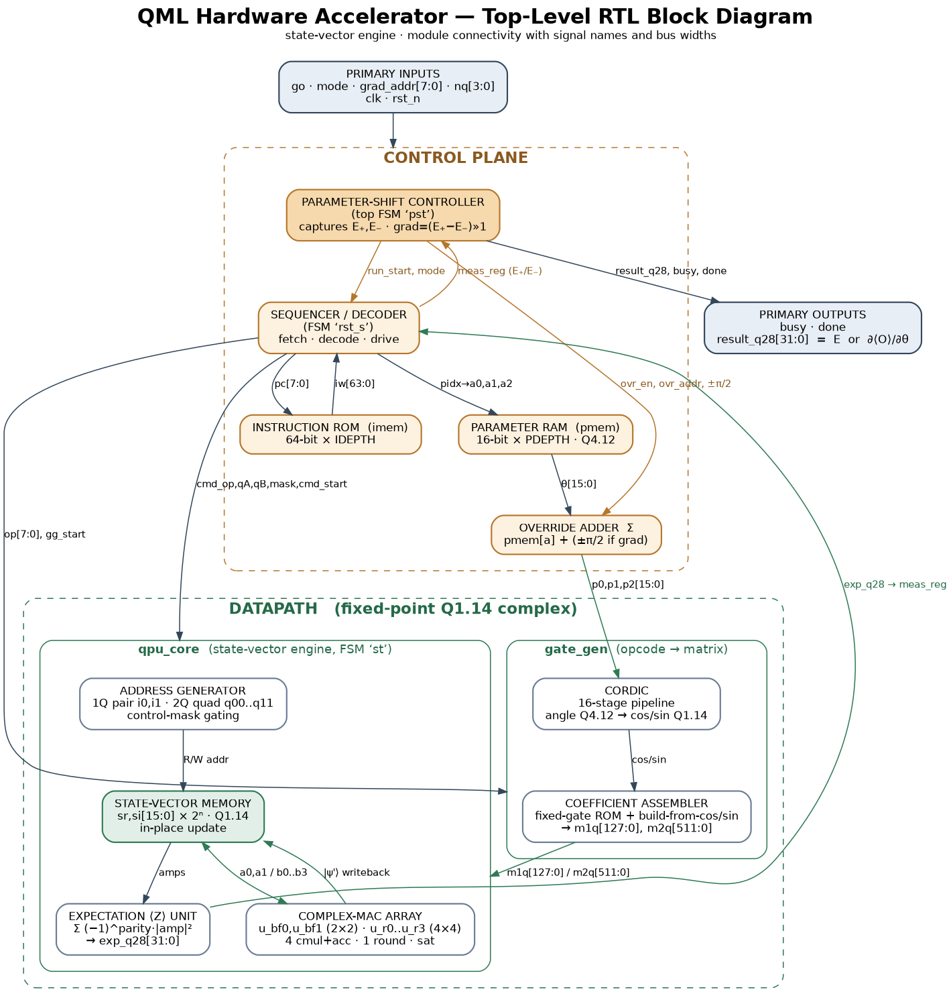
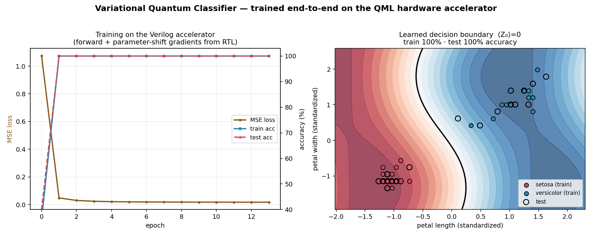
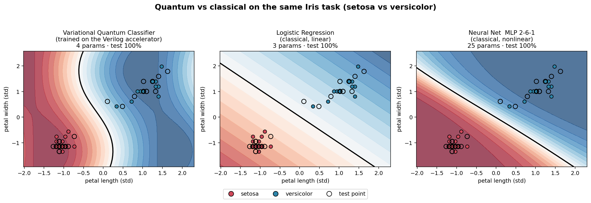

# QML Hardware Accelerator

This is a chip design (written in Verilog) that does the math behind **quantum
machine learning** directly in hardware — running quantum circuits *and* training
them — instead of on a normal computer.

You give it a circuit (a list of steps). It runs the circuit, gives you the
answer, and can even work out the gradients you need to train the model. All of
that happens inside the hardware.



## What does it actually do?

A quantum register of *n* qubits is really just a list of 2ⁿ numbers. Everything
below is a concrete thing the chip does to that list.

**1. Reset** — set the register back to the start (all zeros).

**2. Apply a gate.** This is the main job. A gate changes one or two qubits by
mixing the numbers in the list. The chip knows:

- **Flips & basics:** `X` (a NOT), `Y`, `Z`, and `H` (puts a qubit into a 50/50 superposition).
- **Fixed phase gates:** `S`, `T`, `√X` and their inverses.
- **Rotations by an angle θ — these are the trainable "knobs":** `RX`, `RY`, `RZ`,
  plus the general `U2`/`U3`. To turn a knob it needs the sine and cosine of the
  angle, which it computes with a **CORDIC** (only shifts and adds — no big tables).
- **Two-qubit gates that entangle qubits:** `CNOT` (flip B only if A is 1), `CZ`,
  `SWAP`, `iSWAP`, and the Ising gates `RXX/RYY/RZZ/RZX` used in most quantum-ML circuits.
- **A "controlled" version of anything:** add *"only do this if these qubits are 1"* —
  that gives you `Toffoli`, `Fredkin`, controlled rotations, etc., with no extra hardware.

**3. Measure.** Ask *"what's the average value of this qubit?"* — a number between
−1 and +1 (written ⟨Z⟩). That number is the model's output / prediction.

**4. Get a gradient (for training).** To know how to improve a knob θ, the chip
uses the **parameter-shift rule**: run the same circuit twice — once with θ + 90°,
once with θ − 90° — and subtract. That difference *is* the exact gradient. No
backpropagation, no outside help — the chip does both runs and the subtraction itself.

That's the whole toolbox. Anything in quantum machine learning — encoding your
data, entangling layers, measuring a cost, training the knobs — is built out of
these few operations.

## What happens in one run

Follow the picture above, left to right:

1. You load the **circuit** (the list of instructions) and the **angles** into two small memories.
2. A **sequencer** reads the instructions one at a time.
3. For each gate, a **gate builder** makes its little matrix (using the CORDIC for rotations).
4. The **core** applies that matrix to the list of numbers — or, for a measurement, adds up the right numbers to get ⟨Z⟩.
5. For training, a **parameter-shift controller** does the two shifted runs and hands you the gradient.

## Does it work?

Yes — and it's checked two ways.

**Every piece is verified** against a plain Python simulator: the rotations, every
single gate, 11 known circuits (Bell state, Toffoli, SWAP, …) and 40 random
circuits. They all agree to about 0.0005 — essentially exact for 16-bit hardware.

**It trains a real model.** I trained a small quantum classifier on the real
**Iris** flower dataset, with *every value and every gradient coming from the
Verilog*, and it reached **100% accuracy**.



**It holds up against classical ML.** On the same task it ties a logistic
regression and a small neural net — using the fewest trained parameters:

| Model | Trained parameters | Test accuracy |
|---|---|---|
| **Quantum classifier (this chip)** | **4** | **100%** |
| Logistic regression | 3 | 100% |
| Small neural net | 25 | 100% |



## Run it

You need `iverilog` and Python with `numpy` (plus `matplotlib` and `scikit-learn`
for the two demos).

```bash
bash run_all.sh                            # check everything works
bash train.sh                              # train the quantum classifier on the chip (~80 s)
cd model && python3 compare_classical.py   # quantum vs classical
```

## What's in here

```
rtl/    the hardware itself (Verilog)
tb/     the tests
model/  the Python reference, the quantum classifier, the classical comparison
docs/   the diagrams and the result pictures
ARCHITECTURE.md   the deep technical version, if you want every detail
```

## Want the details?

**[ARCHITECTURE.md](ARCHITECTURE.md)** has the full breakdown — every module, the
number formats, the state machines, a **complete hardware component inventory**
(memories, registers, multipliers, muxes, counters, FSMs), and notes for putting
it on a real FPGA. The `docs/diagrams/` folder has six diagrams (system, CORDIC,
core, MAC cell, state machines, and a component inventory).

*What this is: a "state-vector" accelerator — it runs quantum-ML math exactly, in
regular hardware, which is what training and running quantum models needs today.
It's not a controller for physical qubits.*
